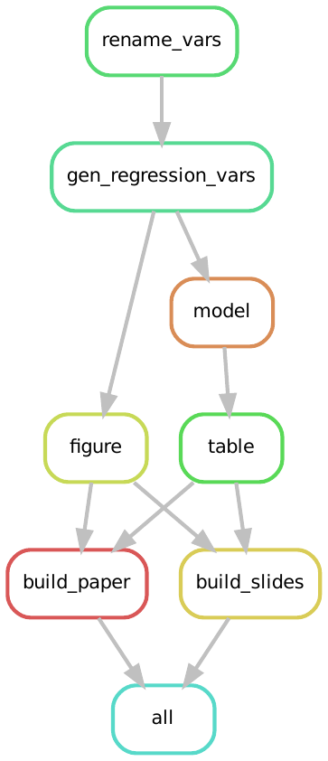
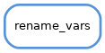

# (PART) Basic Snakemake Workflows {-}

# Initial Steps with Snakemake

:::{- .objectives} 

### Overview {-}

**Questions**

- Where and how do we write Snakemake rules?
- How do we execute a rule?
- How can rules interact with input and output files?
- How does Snakemake deal with redundant executions?

**Objectives**

- Recognize the key parts of a Snakemake rule.
- Run Snakemake from the shell.
- Explain when and why  snakemake executes a rule.
- Understand how to read the output of `snakemake --summary`.
:::


Now that we've explored the structure of our project, we are ready to start building a fully reproducible pipeline.
Snakemake expects instructions in a file called `Snakefile`.
Typically we put the `Snakefile` in the project's main folder (i.e. in `./`).
The `Snakefile` contains a collection of rules that together define the order in which a project will be executed.

We have added an empty `Snakefile` in the main project folder.
You can edit this file in a text editor of your choice.
In the remainder of this tutorial we will edit the file together, gradually constructing the pipeline which reproduces the results from MRW.

## Writing Our First Rule

All good software tutorial seem to start with a hello world example, so we'll follow suit and do the same.
To do so, we open `Snakefile` in a text editor of our choice and write the following text into the file:

```{r, engine = 'bash', eval = FALSE}
rule hello_world:
  shell:
    'echo "Hello World!"'
```

The first line in our example defines the name of a *rule*, in this case `hello_world`.
The part following `shell`: tells Snakemake that this rule executes a shell command, which in our case prints `Hello World!` to the console.

The indentation here is important.
We need the `shell` command to be indented in one `TAB` space from rule.
Additionally we need the shell command `'echo "Hello World!"'` to be indented on `TAB` space further than `shell`.
Snakemake uses the indentation to figure out different components of the each rule.

:::{- .tip}

### Snakefiles are Written as Python 3 Code {-}

Snakemake instructions are written in Python 3 with the addition of a a few extra objects and methods the Snakemake package provides.
The structure of our rule will look very familiar to anybody who has written Python functions before.
The fact that Snakemake is written in Python is why indentation matters.
This implies that indentation is interpreted by the language and that deviations from correct indentation will result in errors.

Throughout the rest of the tutorial, those familiar with Python will continue to see similarities to Python code.
If you do not know Python, there's no need to worry - our explanations and what you need to follow along will not depend on it. 
:::

## Executing a Rule

After saving our changes to `Snakefile`, we can execute the newly created rule by navigating to the project's main folder and by typing `Snakemake --cores 1` into the terminal and then hitting `RETURN`.

```{r, engine = 'bash', eval = FALSE}
$ snakemake --cores 1
```

By default Snakemake will execute the first rule it encounters in a `Snakefile`.
As our file only contains a single rule, it will execute the `hello_world` rule and print `Hello World!` to the console together with some additional information about the execution of the work flow:

```{r, engine = 'out', eval = FALSE}
Building DAG of jobs...
Using shell: /usr/bin/bash
Provided cores: 1 (use --cores to define parallelism)
Rules claiming more threads will be scaled down.
Job counts:
        count   jobs
        1       hello_world
        1

[Fri Feb 26 18:11:00 2021]
rule hello_world:
    jobid: 0

Hello World!
[Fri Feb 26 18:11:00 2021]
Finished job 0.
1 of 1 steps (100%) done
```

When a file contains more than a single rule, we often want to be more explicit and tell `Snakemake` to execute a particular rule like so:

```{r, engine = 'bash', eval = FALSE}
$ snakemake --cores 1 name_of_rule
```

In our case `snakemake --cores 1 hello_world` will give the same output as the last execution.

:::{- .tip}

### `--cores`

At this point you are probably guessing that the long option `--cores SOME_NUMBER` tells Snakemake how many CPU cores to use when executing a workflow. 
This is correct, and `snakemake --cores 1` tells Snakemake to use a single core of your computer when it runs.
Running workflows in parallel, by specifying for example `snakemake --cores 4` can speed up complex workflows substantially when a workflow's rules can be easily parallelized.
In this guide we will execute all workflows with a single core to make the code compatible with all computers.
You are encouraged play around with the core count yourself to and see what effect this may have.
:::

:::{- .warning}

### Snakefiles do not have be be called `Snakefile`

We do not have to call our Snakefile `Snakefile`.
However, if we call it something else, we will need to tell Snakemake where to find the set of rules.

We can do this with the `-s` flag.
For example, if our Snakefile is names `SomeSnakefile`:

```{r, engine = 'bash', eval = FALSE}
$ snakemake -s SomeSnakefile --cores 1 name_of_rule
```

Sometimes the suffix `.smk` is used by researchers to identify Snakefiles not called `Snakefile`, 
  for example `install.smk` 
:::

## First Steps in the MRW Pipeline  

Like most empirical research, our project starts with data management and data cleaning steps.
The data management subdirectory, `src/data-management` contains two scripts:

```{r, engine = 'bash', eval = FALSE}
ls src/data-management
```

```{r, engine = 'out', eval = FALSE}
rename_variables.R
gen_reg_vars.R
```

which need to be executed sequentially.
In this chapter, we want to run the script `rename_variables.R` to tidy up the variable names in our data set.
In the next chapter, we will then add `gen_reg_vars.R`, which creates additional variables to be used in subsequent steps.

### Using the `Rscript` command to execute R scripts

We can run any R script with the `Rscript` shell command.
The command expects the path to an `.R` script as the first argument.
Simple R scripts that do not require additional options can be run as:

```{r, engine = 'bash', eval = FALSE}
Rscript PATH/TO/SCRIPT.R
```

Most scripts in this project have been written to require additional parameters.
To see what additional parameters are needed, we can run the R script with the `--help` option.

Let's apply this and execute the `rename_variables.R` script with the `--help` flag:

```{r, engine = 'bash', eval = FALSE}
$ Rscript src/data-management/rename_variables.R --help
```

This prints the following output to the console:

```{r, engine = 'bash', eval = FALSE}
Usage: src/data-management/rename_variables.R [options]

Options:
	-d CHARACTER, --data=CHARACTER
		stata dataset file name

	-o CHARACTER, --out=CHARACTER
		output file name [default = out.csv]

	-h, --help
		Show this help message and exit
```

This suggests the script expects

1. a `--data` option which defines the filepath to a Stata data set. 
   This is the input dataset which the script transforms.
   For us, this will be the file `src/data/mrw.dta`
2. a `--out` option which defines the filepath the transformed data set will be saved.
   We will save the output to the file `out/data/mrw_renamed.csv`

Let's set up our first rule for the MRW pipeline using the structure we learned from the `hello_world` rule.
We will name the rule `rename_vars` and place it at the top of our Snakefile:

```{r, engine = 'bash', eval = FALSE}
rule rename_vars:
  shell:
    "Rscript src/data-management/rename_variables.R \
        --data src/data/mrw.dta \
        --out out/data/mrw_renamed.csv"
```

Note that `\` in the shell command allows us to write the command over several lines for better readability. 
They can be omitted when we write the command in a single line.

Now if we run Snakemake: 

```{r, engine = 'bash', eval = FALSE}
$ snakemake --cores 1 rename_vars
```

We see that Snakemake executes the script for us, printing output to screen and saving the output file as expected.
Used this way, we can see that a Snakemake rule is an instruction on how to execute part of a project's code.
This is true, but it can be even more powerful than that.

### The `input` and `output` arguments

Our current `rename_vars` rule was simple - it specified one shell command.
We can add some further structure to this rule by specifying **input** and **output** files in a different manner.
We are going to specify rules in the following format:

```{r, engine = 'bash', eval = FALSE}
rule rule_name:
    input:
        input_name1 = "PATH/TO/input_one",
        input_name2 = "PATH/TO/input_two"
    output:
        output_name1 = "PATH/TO/SAVE/output_one",
        output_name2 = "PATH/TO/SAVE/output_two"
    shell:
        "HOW TO MIX IT ALL TOGETHER"
```

In this format, a Snakemake rule can be thought of as the recipe that combines the inputs to produce the outputs. 
We can think of the `input` as ingredients, the `output` as the finished dish and the `shell` part as the recipe itself.
`Snakemake` expects these components to be provided in a particular way so that it knows what to do with the information we provide.

Snakemake rules can have as many inputs and outputs as the rule needs to function.
Each input and each output are given names, for example `input_name1` which takes the value to the file path and name of the input file.
It is important to wrap each of these paths into quotations, and to separate each of the multiple inputs and outputs with a comma, `,`.

### A rule to rename variables.

Let's now use the input and output syntax to update the `rename_vars` rule from above.
The rule will use the `rename_variables.R` script as a first input.
Let us therefore rename the first input into `script` and replace the right hand side with the path to the `rename_variables.R` script which we have used before when we printed the script's help function.

Our `rename_vars` rule should now look something like this:

```{r, engine = 'bash', eval = FALSE}
rule rename_vars:
    input:
        script = "src/data-management/rename_variables.R",
        input_name2 = "PATH/TO/input_two"
    output:
        output_name1 = "PATH/TO/SAVE/output_one",
        output_name2 = "PATH/TO/SAVE/output_two"
    shell:
        "Rscript src/data-management/rename_variables.R \
        --data src/data/mrw.dta \
        --out out/data/mrw_renamed.csv"
```

Next, we want to add any additional inputs and also specify any outputs that the file produces.
From the `help` output we know the script expects a Stata dataset as an additional input, which we can find in the `src/data/` folder.
We rename the second input into `data` and replace the right hand side with the path to @mrw's Stata dataset.
Finally, we replace the first output name with `data` and define an appropriate output file path as the right hand side.
This is the location our transformed data will be saved to.

After these steps, our rule should look something like this:

```{r, engine = 'bash', eval = FALSE}
rule rename_vars:
    input:
        script = "src/data-management/rename_variables.R",
        data   = "src/data/mrw.dta"
    output:
        data = "out/data/mrw_renamed.csv"
    shell:
        "Rscript src/data-management/rename_variables.R \
        --data src/data/mrw.dta \
        --out out/data/mrw_renamed.csv"
```

After saving we can execute our new rule via:

```{r, engine = 'bash', eval = FALSE}
$ snakemake --cores 1 rename_vars
```

Snakemake will give us some console output informing us about the execution of our rule. 
A successful execution will be displayed through green text ending in 

```{r, engine = 'bash', eval = FALSE}
TODO: Make green
Finished job 0.
1 of 1 steps (100%) done
```

If the execution was successful, we can look into our output directory to see if anything has happened:

```{r, engine = 'bash', eval = FALSE}
$ ls out/data/
```

which yields

```{r, engine = 'out', eval=FALSE}
mrw_renamed.csv
```

Our file has been created as we expected.

Looking at our rule, there is a bit of repetition.
In the `shell` section, we repeat the full filepath of all the files use before in the `input` and `output` sections.
Snakemake does not require us to write these paths twice.
We can refer to the inputs and outputs in the shell part of our rule via the names we assigned to them.
For example, we can refer to the script "src/data-management/rename_variables.R" as `{input.script}`,
and the data which is the output as `{output.data}`

Putting it all together will give us the following rule:

```{r, engine = 'bash', eval = FALSE}
rule rename_vars:
    input:
        script = "src/data-management/rename_variables.R",
        data   = "src/data/mrw.dta"
    output:
        data = "out/data/mrw_renamed.csv"
    shell:
        "Rscript {input.script} \
            --data {input.data} \
            --out {output.data}"
```

Now let's run the rule once more:

```{r, engine = 'bash', eval = FALSE}
$ snakemake --cores 1 rename_vars
```

We see the following output:

```{r, engine = 'out', eval = FALSE}
Building DAG of jobs...
Nothing to be done.
```

This is not an error, it simply says that Snakemake doesn't need to run the rule again.
It's time to think about why that could be the case.

## No Redundant Executions

To understand the status of the project as seen by Snakemake, we can use the **summary** option of Snakemake:

```{r, engine = 'bash', eval = FALSE}
$ snakemake --summary
```

In our case the following output is printed to the console:

```{r, engine = 'out', eval = FALSE}
Building DAG of jobs...
output_file	                      date	                  rule	    version	 log-file(s)	status	plan
out/data/mrw_renamed.csv	Thu Jan 10 20:31:08 2019	rename_vars	   -		             ok	    no update

```

Snakemake tells us the status of the output file of the `rename_vars` rule is `ok` and that it plans not to update the file.

Now, let us see what happens if we update one of the input files.
The following command updates the time that `rename_variables.R` was last edited without changing the actual content of the file: 

```{r, engine = 'bash', eval = FALSE}
$ touch src/data-management/rename_variables.R
```

Running the summary command again

```{r, engine = 'bash', eval = FALSE}
$ snakemake --summary
```

yields the following output:

```{r, engine = 'out', eval = FALSE}
Building DAG of jobs...
output_file	                       date	                   rule	    version	log-file(s)	     status	               plan
out/data/mrw_renamed.csv	Thu Jan 10 20:31:08 2019	rename_vars	   -		        updated input files	update pending
```

Snakemake has detected that one input file is more recent than the output file.
It therefore will execute the rule when asked to do so.

Running the rule again via:

```{r, engine = 'bash', eval = FALSE}
snakemake --cores 1 rename_vars
```

will execute the rule.

We see one major advantage of Snakemake over alternative ways to execute projects.
Snakemake keeps track of updates to input files and dependencies between files.This allows Snakemake to only re-runs a rule if an input has changed.
This means we no longer have to think about when we last ran a script and if we need to run it again.
Snakemake's management of dependencies will turn out to be quite advantageous as we develop a larger project.
No longer do we need to think about order of execution and when to re-run files.^[
  Or, when to comment out chunks of a large script because "we don't need to update that bit."
]

## Our Workflow in Graphs

Throughout Parts II to IV we are going to build up our workflow to reproduce MRW's analysis pipeline.
In our motivation chapter we explained how our final workflow should be a connection between a set of rules,which we have depicted graphically as:

```{r, fig.align="center", echo=FALSE}

```

So far, we have constructed the first of those blocks an our set of rules in our current workflow looks like this:

```{r, fig.align="center", echo=FALSE}

```

We have made the first step in the data analysis pipeline.
Let's continue creating new steps in the next chapter.