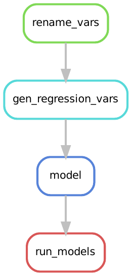
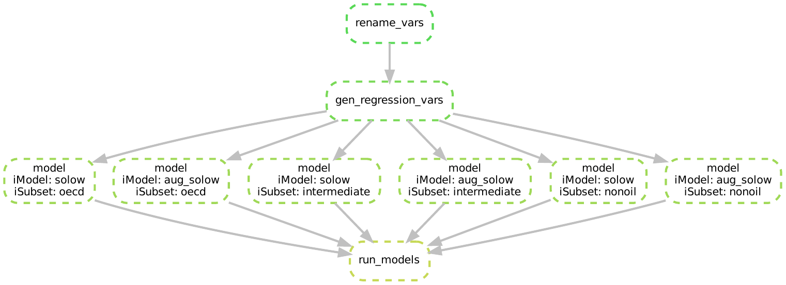
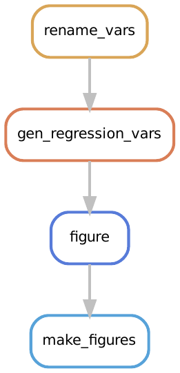
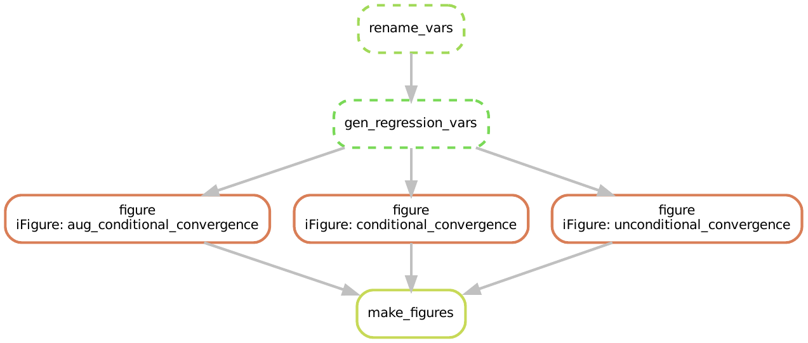

# Wildcards in Target Rules


:::{- .objectives} 
### Overview {-}

**Questions**

- How can we use wildcards to simplify target rules?
- How do we make the build plan explicit in target rules?
- How do we combine more than one wildcard in a single target rule?

**Objectives**

- Introduce wildcards to target rules
- Explain what the `expand()` function is and how to ues it
- Learn how to use multiple wildcards in a single rule

:::

:::{- .prereq}
### Snakefile Status {-}

After the last chapter our Snakefile should look like this:

```{r, engine = 'bash', eval = FALSE}
# --- Target Rules --- #

rule solow_target:
    input:
        intermediate = "out/analysis/model_solow_subset_intermediate.rds",
        nonoil       = "out/analysis/model_solow_subset_nonoil.rds",
        oecd         = "out/analysis/model_solow_subset_oecd.rds"


# --- Build Rules --- #

rule solow_model:
    input:
        script = "src/analysis/estimate_ols_model.R",
        data   = "out/data/mrw_complete.csv",
        model  = "src/model-specs/model_solow.json",
        subset = "src/data-specs/subset_{iSubset}.json"
    output:
        estimate = "out/analysis/model_solow_subset_{iSubset}.rds"
    shell:
        "Rscript {input.script} \
            --data {input.data} \
            --model {input.model} \
            --subset {input.subset} \
            --out {output.estimate}"

rule gen_regression_vars:
    input:
        script = "src/data-management/gen_reg_vars.R",
        data   = "out/data/mrw_renamed.csv",
        param  = "src/data-specs/param_solow.json"
    output:
        data   = "out/data/mrw_complete.csv"
    shell:
        "Rscript {input.script} \
            --data {input.data} \
            --param {input.param} \
            --out {output.data}"

rule rename_vars:
    input:
        script = "src/data-management/rename_variables.R",
        data   = "src/data/mrw.dta"
    output:
        data = "out/data/mrw_renamed.csv"
    shell:
        "Rscript {input.script} \
            --data {input.data} \
            --out {output.data}"

# --- Clean Rules --- #

rule clean:
    shell:
        "rm -rf out/*"

rule clean_data:
    shell:
        "rm -rf out/data/*"

rule clean_analysis:
    shell:
        "rm -rf out/analysis/*"
```

This will be our starting point for this chapter.
:::

In the last chapter we have learned how to use wildcards to eliminate unnecessary repetitions in our code.
Next, we will learn how to apply wildcards to our target rules with help of the `expand()` function.

## The `expand()` function

When we look at our target rule:

```{r, engine = 'out', eval = FALSE}
rule solow_target:
    input:
        intermediate = "out/analysis/model_solow_subset_intermediate.rds",
        nonoil       = "out/analysis/model_solow_subset_nonoil.rds",
        oecd         = "out/analysis/model_solow_subset_oecd.rds"
```

We can see that the inputs have a very similar structure:

* The inputs live on the same path `out/analysis/`
* The filenames of each input begin with `model_solow_subset` and end with `.rds`.  

They only differ in the name of the subset of data we are using: `intermediate`, `nonoil`, and `oecd`.

After what we learned in the [previous chapter on wildcards](./wildcards.html), we should be thinking that there must be a way to reduce the repetition.
Let's try simply adding a wildcard for the varying part of the input files.
We can do this by condensing the three inputs in `solow_target` into one as follows:


```{r, engine = 'out', eval = FALSE}
rule solow_target:
    input:
        models = "out/analysis/model_solow_subset_{iSubset}.rds",

```

To see if this has any bite, and would work as we intuitively think it might we will want to run Snakemake.
Before we do, let's clean the output folder and start afresh:

```{r, engine = 'out', eval = FALSE}
$ snakemake --cores 1 clean
```

Then, we run our new target rule with the wildcard we added:

```{r, engine = 'out', eval = FALSE}
$ snakemake --cores 1 solow_target
```

This didn't do as we intuitively had hoped. 
Instead we get the following error:

```{r, engine = 'out', eval = FALSE}
Building DAG of jobs...
WildcardError in line 12 of /home/lachlan/teaching/snakemake-econ-r-learner/Snakefile:
Wildcards in input files cannot be determined from output files:
'iSubset'
```

Recall that Snakemake won't run a target rule that contains a wildcard because it does not know how to resolve it.^[
    If this doesn't feel like a familar argument to you, review the material from the previous chapter [here](#wildcards-tidying).
]
Snakemake doesn't know that `{iSubset}`  should first be replaced with `oecd`, then with `intermediate`, and finally with `nonoil`.
It is our job to be a bit more explicit and tell Snakemake that this is what we want to happen.

Snakemake has a functionality that allows us to tell it how to take a wildcard and replace it with a specific set of values.
The `expand()` function provides this for us.
As the name suggests its job is to expand a wildcard by replacing it iteratively with specified values.

We can use the `expand()` function as follows:

```{r, engine = 'out', eval = FALSE}
rule solow_target:
    input:
        expand("out/analysis/model_solow_subset_{iSubset}.rds",
                    iSubset = DATA_SUBSET)
```

This tells Snakemake to replace the wildcard `{iSubset}` with values from an object we have called `DATA_SUBSET`.
We now have to replace `DATA_SUBSET` with a **list** of values that we want to substitute in for`{iSubset}`.

## Using `expand()` with a List

In Python and Snakemake lists can be thought of as a container that store many values.
We create a list by putting the values we want  inside square brackets and separating the values with commas.
In our case, a list of the three subsets of the data looks like this: `["nonoil", "oecd", "intermediate"]`.

Let us replace `DATA_SUBSET` with our new list of subset names:

```{r, engine = 'out', eval = FALSE}
rule solow_target:
    input:
        expand("out/analysis/model_solow_subset_{iSubset}.rds",
                    iSubset = ["nonoil", "oecd", "intermediate"])
```

We use the `--summary` option of Snakemake to see the build plan:

```{r, engine = 'out', eval = FALSE}
$ snakemake --summary
```

```{r, engine = 'out', eval = FALSE}
output_file     date    rule    version log-file(s)     status  plan
out/analysis/model_solow_subset_nonoil.rds         -       solow_model     -               missing update pending
out/analysis/model_solow_subset_oecd.rds           -       solow_model     -               missing update pending
out/analysis/model_solow_subset_intermediate.rds   -       solow_model     -               missing update pending
out/data/mrw_complete.csv       -       gen_regression_vars     -               missing update pending
out/data/mrw_renamed.csv        -       rename_vars     -               missing update pending
```

The first three lines show us that Snakemake plans to build the three files `out/analysis/model_solow_subset_nonoil.rds`, `out/analysis/model_solow_subset_oecd.rds`, `out/analysis/model_solow_subset_intermediate.rds` from our original target rule.
This means Snakemake has indeed replaced the wildcard `iSubset` with the correct three values just like we wanted.^[
    Note that the `--summary` command did not throw an error message.
    This means we have solved the `WildcardError` we began with.
]
We have successfully simplified our target rule.

:::{- .tip}

### Adding Python 3 Code Outside of Snakemake Rules {-}

Snakemake accepts any Python 3 code outside of rules.
You can add Python 3 lists or functions anywhere in a Snakefile.
You can then use the these lists or functions in the Snakemake rules as needed.

:::

So far, we defined the list passed to the expand function at the time we needed it, inside the call to expand function.
While this makes explicit  what values we want the expand function to iterate through, it might be better practice to define the list outside of it.
What this would mean is to create a list somewhere else in our Snakefile, and then tell Snakemake to use this pre-defined list inside the expand function.  


Let us see this idea in action.
We will create our list of data subsets at the beginning of our Snakefile and then reference it in the rule `solow_target`.
Create a list called `DATA_SUBSET` at the beginning of the Snakefile as follows:^[
    We capitalize lists that we iterate over to separate them from other parts of code. 
    This is not essential but makes life a bit easier sometimes. 
    Whenever you see a capitalized name, you know it is a list that we want to iterate over.]

```{r, engine = 'out', eval = FALSE}
DATA_SUBSET = ["oecd", "intermediate", "nonoil"]
```

We then need to refer to the list by name inside our `expand()` function.
To do so, we replace the explicit list we had before with the name of our newly constructed `DATA_SUBSET` list:

```{r, engine = 'out', eval = FALSE}
rule solow_target:
    input:
        expand("out/analysis/model_solow_subset_{iSubset}.rds",
                    iSubset = DATA_SUBSET)
```

Now us execute our rule:

```{r, engine = 'out', eval = FALSE}
$ snakemake --cores 1 
```

The last part of the output from the Snakemake rule is:

```{r, engine = 'out', eval = FALSE}
TODO: Add Output
```

Nice, everything seems to have worked. 
If we look into our output folder, we should now see the three output models:

```{r, engine = 'out', eval = FALSE}
ls out/analysis
```

```{r, engine = 'out', eval = FALSE}
model_solow_subset_nonoil.rds 
model_solow_subset_oecd.rds 
model_solow_subset_intermediate.rds 
```

Why might we have advocated for creating lists outside of the expand function?
There are at least the following three reasons you might want to do so:

1. If we want to re-use the same list of values in another rule, we would have to write the list again or copy and paste it into the second rule.
   As before, this introduces extra room for errors.
2. It can be hard to find the lists we are iterating over when we read through the Snakefile. 
   Putting all lists we are using at the top of `Snakefile` makes this easier.
3. In the next chapter we will introduce a new function which allows us to construct lists which we pass to `expand()` from the files in our project automatically.
   For this task it will be very advantageous to define lists outside of rules.


::: {- .challenge} 

### Exercise: Exploring the expand function {-}

@mrw contains three plots.
Each of these plots use the data subset of 'intermediate' countries.
The `src/figures/` subdirectory contains three scripts which correspond to the three plots in the paper.^[
This is not entirely true, we are yet to figure out how to get the y-axis range from the original paper.
]

It is your task to use what you have learned so far to create a workflow to produce the figures.
To do so, follow the following steps:

1. Write three rules `fig1`, `fig2` and `fig3` to produce each figure. 
   Each figure should be saved to the following output filepath `out/figures/SCRIPTNAME.pdf` 
2. Create a list called `PLOTS` that contains the file names of each of the three plot scripts (without the path or the `.json` file ending).
3. Use what you have learned about **wildcards** to simplify the three rules `fig1`, `fig2`, and `fig3` into a single rule called `figures`. What part of the rule needs a wildcard?
4. Use the `expand()` function to create a target rule named `make_figures`.
5. Use the summary function to check that all three figures are planned to be created correctly.
6. Create all three figures with a single execution of`snakemake --cores 1 figs_target`.
7. Make sure that the files have been written to the output folder.

HINT:
The scripts are written in such a way that they accept exactly the same options.
Check first, what inputs the scripts expect.

:::

::: {- .answer} 

### SOLUTION: {-}

In this problem the three rules `fig1`, `fig2`, and `fig3` only differ in the `{input.model}` they take and the output filename. We therefore have use wildcards in both to unify them.
The target rule `make_figures` then uses the `expand()` function and a list of the filenames without the `.json` ending to create all three plots.

After completing all steps. your `Snakefile` should look something like this:

```{r, engine = 'bash', eval = FALSE}
# --- Dictionaries --- #

DATA_SUBSET = ["oecd",
               "intermediate",
               "nonoil"
]

PLOTS = [
    "aug_conditional_convergence",
    "conditional_convergence",
    "unconditional_convergence"
]


# --- Target Rules --- #

rule make_figures:
    input:
        expand("out/figures/{iFigure}.pdf",
                    iFigure = PLOTS)

rule solow_target:
    input:
        expand("out/analysis/model_solow_subset_{iSubset}.rds",
                    iSubset = DATA_SUBSET)


# --- Build Rules --- #

rule figures:
    input:
        script = "src/figures/{iFigure}.R",
        data   = "out/data/mrw_complete.csv",
        subset = "src/data-specs/subset_intermediate.json"
    output:
        fig = "out/figures/{iFigure}.pdf"
    shell:
        "Rscript {input.script} \
            --data {input.data} \
            --subset {input.subset} \
            --out {output.fig}"

rule solow_model:
    input:
        script = "src/analysis/estimate_ols_model.R",
        data   = "out/data/mrw_complete.csv",
        model  = "src/model-specs/model_solow.json",
        subset = "src/data-specs/{iSubset}.json"
    output:
        estimate = "out/analysis/model_solow_{iSubset}.rds"
    shell:
        "Rscript {input.script} \
            --data {input.data} \
            --model {input.model} \
            --subset {input.subset} \
            --out {output.estimate}"

rule gen_regression_vars:
    input:
        script = "src/data-management/gen_reg_vars.R",
        data   = "out/data/mrw_renamed.csv",
        param  = "src/data-specs/param_solow.json"
    output:
        data   = "out/data/mrw_complete.csv"
    shell:
        "Rscript {input.script} \
            --data {input.data} \
            --param {input.param} \
            --out {output.data}"

rule rename_vars:
    input:
        script = "src/data-management/rename_variables.R",
        data   = "src/data/mrw.dta"
    output:
        data = "out/data/mrw_renamed.csv"
    shell:
        "Rscript {input.script} \
            --data {input.data} \
            --out {output.data}"


# --- Clean Rules --- #

rule clean:
    shell:
        "rm -rf out/*"

rule clean_data:
    shell:
        "rm -rf out/data/*"

rule clean_analysis:
    shell:
        "rm -rf out/analysis/*"

```

You can check the summary via

```{r, engine = 'bash', eval = FALSE}
snakemake --summary make_figures 
```

run the rule via

```{r, engine = 'bash', eval = FALSE}
snakemake --cores 1 make_figures
```

and check the output via

```{r, engine = 'bash', eval = FALSE}
ls out/figures
```

:::

## Estimating a New Model

So far we have estimated the basic Solow model.
@mrw also estimate an augmented version of the Solow model which adds human capital.
You can find the regression model required to estimate the augmented model in `src/model-specs/model_aug_solow.json`.

We can estimate this regression model across each of the three data sets by creating two new rules:

- `aug_solow_model` -  a rule that specifies how to estimate the regression model
    - This should be conceptually very similar ot the `solow_model` rule
- `aug_solow_target` - a target rule, using the `expand()` function to estimate the augmented solow model across the datasets specified in DATA_SUBSET.
    - This will look very similar to the `solow_target` rule.

Let's first create the `aug_solow_model` rule:

```{r class.source = 'fold-show', engine = 'bash', eval = FALSE}
rule aug_solow_model:
    input:
        script = "src/analysis/estimate_ols_model.R",
        data   = "out/data/mrw_complete.csv",
        model  = "src/model-specs/model_aug_solow.json",
        subset = "src/data-specs/subset_{iSubset}.json"
    output:
        estimate = "out/analysis/model_aug_solow_subset_{iSubset}.rds"
    shell:
        "Rscript {input.script} \
            --data {input.data} \
            --model {input.model} \
            --subset {input.subset} \
            --out {output.estimate}"

```

And then the `aug_solow_target`:

```{r class.source = 'fold-show', engine = 'bash', eval = FALSE}
rule aug_solow_target:
    input:
        expand("out/analysis/model_aug_solow_subset_{iSubset}.rds",
                    iSubset = DATA_SUBSET)
```

Finally, we can estimate the new regression model by  executing the `aug_solow_target` rule with Snakemake:

```{r, engine = 'out', eval = FALSE}
snakemake --cores 1 aug_solow_target
```

## Expanding Multiple Wildcards

The rules used to estimate the standard Solow model and the augmented Solow model are identical except for the model they use.

The only difference between the `aug_solow_target` and `solow_target` rules is that the filename differs by three letters: `out/analysis/model_aug_solow_{iSubset}.rds` versus
  `out/analysis/model_solow_{iSubset}.rds`.


```{r class.source = 'fold-show', engine = 'out', eval = FALSE}

rule solow_target:
    input:
        expand("out/analysis/model_solow_subset_{iSubset}.rds",
                    iSubset = DATA_SUBSET)

rule aug_solow_target:
    input:
        expand("out/analysis/model_aug_solow_subset_{iSubset}.rds",
                    iSubset = DATA_SUBSET)

```

And, when we look at `aug_solow_model` and compare it to `solow_model` we again see only small differences:
the model changes from `model_aug_solow.json` to `model_solow.json` and the outputs change in a similar way.

```{r class.source = 'fold-show', engine = 'out', eval = FALSE}
rule solow_model:
    input:
        script = "src/analysis/estimate_ols_model.R",
        data   = "out/data/mrw_complete.csv",
        model  = "src/model-specs/model_solow.json",
        subset = "src/data-specs/subset_{iSubset}.json"
    output:
        estimate = "out/analysis/model_solow_subset_{iSubset}.rds"
    shell:
        "Rscript {input.script} \
            --data {input.data} \
            --model {input.model} \
            --subset {input.subset} \
            --out {output.estimate}"

rule aug_solow_model:
    input:
        script = "src/analysis/estimate_ols_model.R",
        data   = "out/data/mrw_complete.csv",
        model  = "src/model-specs/model_aug_solow.json",
        subset = "src/data-specs/subset_{iSubset}.json"
    output:
        estimate = "out/analysis/model_aug_solow_subset_{iSubset}.rds"
    shell:
        "Rscript {input.script} \
            --data {input.data} \
            --model {input.model} \
            --subset {input.subset} \
            --out {output.estimate}"
```

We want to exploit this similarity and condense these four rules into two:

- a rule that estimates the model, named `model`, and 
- a target rule that will run each specification, named `run_models`.

Let's do this in reverse order, i.e. starting with creating the `run_models` target rule.

### Unifying the Target Rules

First, we are going to take our two rules `aug_solow_target` and `solow_target` and replace them with one rule.
To do this, we remove the existing rules and replace them with the following:

```{r, engine = 'out', eval = FALSE}
rule run_models:
    input:
        expand("out/analysis/model_{iModel}_subset_{iSubset}.rds",
                    iSubset = DATA_SUBSET,
                    iModel = MODELS)
```

What this says is `run_models` wants to create regression estimates for multiple datasets, by iterating through our existing list `DATA_SUBSET` and 
replacing `{iSubset}` with each of these values one after the other. 
Furthermore, it wants to create regression estimates across multiple models, by iterating through a list called `MODELS` and replacing `{iModel}` with each of these values successively.
Combined, that means `run_models` will create regression estimates for each of the pairwise combinations of elements in the `DATA_SUBSET` and `MODELS` lists.  

We have not specified the list `MODELS` yet, so let's do that now.
`MODELS` contains two elements, `solow` and `aug_solow` - which are the names of the models we estimate.
Let's add this to the top of our Snakefile:

```{r, engine = 'out', eval = FALSE}
MODELS = [
          "solow",
          "aug_solow"
          ]
```

### Unifying How Regression Outputs are Built

The rule `run_models` tells Snakemake what we want to produce.
Now we have to dictate how these estimates can be produced - i.e. how to we combine data, regression models and R scripts to produce the outputs.
We are going to replace the two rules `solow_model` and `aug_solow_model` with one rule `model` that can  estimate *both* regression models.
To do this, we generalize these existing rules.
The `{input.model}` is what needs generalization - instead of taking the value `model_solow.json` OR `model_aug_solow.json` it will take a wildcard value `model_{iModel}.json`.
This should give us the following:^[
    Instead of typing out this new rule `models` and deleting `solow_model` and `aug_solow_model`, you could delete the rule `aug_solow_model` and modify the `solow_rule` so that it looks like this.
]

```{r, engine = 'out', eval = FALSE}
rule model:
    input:
        script = "src/analysis/estimate_ols_model.R",
        data   = "out/data/mrw_complete.csv",
        model  = "src/model-specs/model_{iModel}.json",
        subset = "src/data-specs/subset_{iSubset}.json"
    output:
        estimate = "out/analysis/model_{iModel}_subset_{iSubset}.rds"
    shell:
        "Rscript {input.script} \
            --data {input.data} \
            --model {input.model} \
            --subset {input.subset} \
            --out {output.estimate}"
```

Now the rule `model` can estimate an OLS model using different regression specification by substituting a value into `{iModel}`,  and across different data sets by substituting a value into `{iSubset}`.
The target rule we created above, tells Snakemake which values to substitute.

### Running the New Rule

To see this new rule in action, let's start by cleaning our output folder to start fresh:

```{r, engine = 'bash', eval = FALSE}
snakemake --clean
```

Before running Snakemake let's look at the summary information from Snakemake:

```{r, engine = 'out', eval = FALSE}
$ snakemake --summary
```

which yields:

```{r, engine = 'out', eval = FALSE}
output_file     date    rule    version log-file(s)     status  plan
out/analysis/model_solow_subset_oecd.rds        -       -       -       -       missing update pending
out/analysis/model_aug_solow_subset_oecd.rds    -       -       -       -       missing update pending
out/analysis/model_solow_subset_intermediate.rds        -       -       -       -       missing update pending
out/analysis/model_aug_solow_subset_intermediate.rds    -       -       -       -       missing update pending
out/analysis/model_solow_subset_nonoil.rds      -       -       -       -       missing update pending
out/analysis/model_aug_solow_subset_nonoil.rds  -       -       -       -       missing update pending
out/data/mrw_complete.csv       -       gen_regression_vars     -               missing update pending
out/data/mrw_renamed.csv        -       rename_vars     -               missing update pending
```

This confirms that our new target and model rules work.
Snakemake plans to do the data management steps and build all six model outputs afterwards.

Let's now execute our target rule:

```{r, engine = 'out', eval = FALSE}
$ snakemake --cores 1 run_models
```

::: {- .tip}

Notice how the figures aren't produced automatically. 
Do you remember why?
If not, revisit the previous chapter.
You can build them with `snakemake --cores 1 make_figures`

:::


## Our Workflow in Graphs 

We've make some good progess in this chapter using `expand()` to reduce replication in our Snakefile.
The Snakemake rule graph which shows the rules we execute in our workflow is now:

```{r, echo=FALSE}

```

This says to run the rule `run_models` - Snakemake expands wildcards and builds the regression outputs using the `models` rule.
Before the models are run, the data cleaning steps are completed in order.

We can get an even more insightful perspective on what Snakemake is doing under the hood by looking at the DAG:

```{r, echo=FALSE}

```

The DAG makes even clearer what our workflow is doing:

* Snakemake wants to build the inputs listed in  `run_models`
* It can build those inputs by running the `model` rule six times when it iterates over the wildcards
* To run each model, it needs the clean data, so it needs to run the two data cleaning steps first

Notice that the rule graph and DAG don't show us how the figures are created. 
This is because the rule that generates figures, `make_figures` is not the first rule in the Snakefile.
For the sake of completeness, the rulegraph for how figures are made is:

```{r, echo=FALSE}

```

And the DAG is:

```{r, echo=FALSE}

```

We leave it to the interested reader to provide themselves a verbal understanding of what these graphs mean in terms of workflow execution.