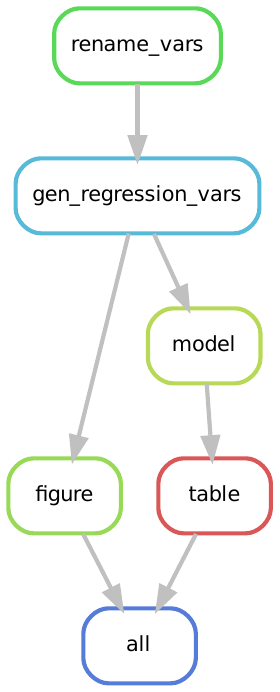

# Adding Papers and Slides to a Snakemake Workflow

## Learning Objectives

TBD


!! TODO: warning on Rmarkdown / bookdown etc installs 


## State of Our Snakefile

```{r, engine = 'bash', eval = FALSE}
MODELS = glob_wildcards("src/model-specs/{fname}.json").fname 

# note this filter is only needed coz we are running an older version of the src files, will be updated soon
DATA_SUBSET = glob_wildcards("src/data-specs/{fname}.json").fname
DATA_SUBSET = list(filter(lambda x: x.startswith("subset"), DATA_SUBSET))

PLOTS = glob_wildcards("src/figures/{fname}.R").fname

TABLES = glob_wildcards("src/table-specs/{fname}.json").fname


##############################################
# TARGETS
##############################################

rule all:
    input:
        expand("out/figures/{iFigure}.pdf",
                    iFigure = PLOTS),
        expand("out/tables/{iTable}.tex",
                    iTable = TABLES) 

rule make_tables:
    input:
        expand("out/tables/{iTable}.tex",
                iTable = TABLES)

rule run_models:
    input:
        expand("out/analysis/{iModel}.{iSubset}.rds",
                    iSubset = DATA_SUBSET,
                    iModel = MODELS)

rule make_figures:
    input:
        expand("out/figures/{iFigure}.pdf",
                    iFigure = PLOTS)


##############################################
# INTERMEDIATE RULES
##############################################

# table: build one table
rule table:
    input:
        script = "src/tables/regression_table.R",
        spec   = "src/table-specs/{iTable}.json",
        models = expand("out/analysis/{iModel}.{iSubset}.rds",
                        iModel = MODELS,
                        iSubset = DATA_SUBSET),
    output:
        table = "out/tables/{iTable}.tex"
    shell:
        "Rscript {input.script} \
            --spec {input.spec} \
            --out {output.table}"

rule model:
    input:
        script = "src/analysis/estimate_ols_model.R",
        data   = "out/data/mrw_complete.csv",
        model  = "src/model-specs/{iModel}.json",
        subset = "src/data-specs/{iSubset}.json"
    output:
        estimate = "out/analysis/{iModel}.{iSubset}.rds"
    shell:
        "Rscript {input.script} \
            --data {input.data} \
            --model {input.model} \
            --subset {input.subset} \
            --out {output.estimate}"

rule figure:
    input:
        script = "src/figures/{iFigure}.R",
        data   = "out/data/mrw_complete.csv",
        subset = "src/data-specs/subset_intermediate.json"
    output:
        fig = "out/figures/{iFigure}.pdf"
    shell:
        "Rscript {input.script} \
            --data {input.data} \
            --subset {input.subset} \
            --out {output.fig}"

rule gen_regression_vars:
    input:
        script = "src/data-management/gen_reg_vars.R",
        data   = "out/data/mrw_renamed.csv",
        param  = "src/data-specs/param_solow.json"
    output:
        data   = "out/data/mrw_complete.csv"
    shell:
        "Rscript {input.script} \
            --data {input.data} \
            --param {input.param} \
            --out {output.data}"

rule rename_vars:
    input:
        script = "src/data-management/rename_variables.R",
        data   = "src/data/mrw.dta"
    output:
        data = "out/data/mrw_renamed.csv"
    shell:
        "Rscript {input.script} \
            --data {input.data} \
            --out {output.data}"


##############################################
# CLEANING RULES
##############################################

rule clean:
    shell:
        "rm -rf out/*"

rule clean_data:
    shell:
        "rm -rf out/data/*"

rule clean_analysis:
    shell:
        "rm -rf out/analysis/*"

```

## Where We Are

In the last chapter we constructed a new target rule, 
  which we called `all`,
  to combine the table and figure outputs.
This enabled us to be able to run the whole project from start to finish with the command `snakemake --cores 1`.
At this end point our workflow is illustrated by the following rulegraph:

```{r, fig.align="center", echo=FALSE}

```

The possibility to end our workflow with the outputs of our data analysis is one possible end-point.
An alternative endpoint is to extend the workflow to also manage the build of the literate outputs of the project,
  which in most cases is a paper and a set of slides.
In what follows we explore this extension.

## Building a Paper 

Our project's source files have everything we need to construct a paper:

* Data analytic outputs in the form of graphs and tables, in `out/figures` and `out/tables`
* Text of a short paper, located in `src/paper/`
* A script to construct the paper, located in `src/lib/build_article.R`^[
  Note that the script to construct the paper is in `src/lib` rather than `src/paper`.
  This is because the script `build_article.R` is quite general and can easily be used across multiple projects.
  We like to put scripts that are not specific to the current project in `src/lib`.
]

This suggests that a rule to build a paper might look like the following:

```{r, engine = 'bash', eval = FALSE}
rule build_paper:
    input:
        script = "src/lib/build_article.R",
        <SOME WAY TO ADD TABLES, FIGURES AND PAPER CONTENTS>
    output:
        pdf = "out/paper/paper.pdf"
    shell:
        "Rscript {input.script} <SOME_CLI_OPTIONS>"

```

This is the structure we want to adopt.
To see how we can flesh out the remaining structure, 
  where `<SOME...>` suggests we need further specification, 
  let's look at what the script `src/lib/build_article.R` expects as command line arguments:

```{r, engine = 'bash', eval = FALSE}
Rscript src/lib/build_article.R --help
```

which yields:

```{r, engine = 'out', eval = FALSE}
Usage: src/lib/build_article.R [options]


Options:
        -i CHARACTER, --index=CHARACTER
                Name of rmarkdown file where paper metadata is located

        -h, --help
                Show this help message and exit

```

This tells us we need to find an Rmarkdown file with the paper metadata.
Intuitively, the project's structure tells us we should look for a file in `src/paper`.
Let's do just that:

```{r, engine = 'bash', eval = FALSE}
ls src/paper
```

which returns the following:

```{r, engine = 'out', eval = FALSE}
01-intro.Rmd       03-data.Rmd     _bookdown.yml  _output.yml   references.bib
02-literature.Rmd  04-results.Rmd  index.Rmd      preamble.tex
```

There's a lot there. 
The file we are after is `index.Rmd`.
So let's update our rule `build_paper` with what we have learned:

```{r, engine = 'bash', eval = FALSE}
rule build_paper:
    input:
        script = "src/lib/build_article.R",
        index  = "src/paper/index.Rmd"
        <SOME WAY TO ADD TABLES, FIGURES AND PAPER CONTENTS>
    output:
        pdf = "out/paper/paper.pdf"
    shell:
        "Rscript {input.script} --index {input.index}"

```

Now, there is a lot of other files in `src/paper/` apart from `index.Rmd`.
Here's a brief summary of what they do:

* `01-intro.Rmd`, ... `04-results.Rmd` contain the textual content of the paper,
   and insert the figures and tables where we need them.
   Each file is a section of the paper, and files are numbered in the order we want the sections to appear.^[
   By default, `bookdown` - our `R` package that builds the paper wants to insert files in an alpha-numeric order *after* `index.Rmd`.
   We go along with this by numbering files in the order we want them.
   There's also a way to manually specify the order as a list of file names, but we think this numeric way is a bit easier.
   (It also keeps the files in order in our directory so we can glimpse the structure and easily find the file we want to edit.)
   ]
* `preamble.tex` contains some additional latex packages and environments we need to build the article
* `references.bib` contains any references we will cite in the paper, in BIBTeX format.
* `agsm.bst` formats our bibliography.
* `_bookdown.yml` - a file that tells `R` where we want the output to be saved, and what to call it.
  We've set that up to be saved in `out/paper/` and the filename be `paper.pdf`.
* `_output.yml` - a file that tells `R` how to construct the paper, i.e. what template we need, and if we need other latex packages.

We need all these files to be inputs to the rule `build_paper`.
This is so a rebuild of the paper is triggered any time we change on of these files.
We could manually specify each one, or we could use the notion of `glob_wildcards` to collect the files by name,
  and then use `expand()` to include all of these files in the rule.
First, let's do the `glob_wildcards` step - we want all files in `src/paper`: 

```{r, engine = 'bash', eval = FALSE}
TABLES = ...

PAPER_FILES  = glob_wildcards("src/paper/{fname}").fname

##############################################
```

And then we update the rule `build_paper` once more to `expand` over all files we found in the `glob_wildcards` step:

```{r, engine = 'bash', eval = FALSE}
rule build_paper:
    input:
        script = "src/lib/build_article.R",
        paper  = PAPER_FILES
        <SOME WAY TO ADD TABLES AND FIGURES>
    output:
        pdf = "out/paper/paper.pdf"
    shell:
        "Rscript {input.script} --index src/paper/index.Rmd"

```

Finally we need to add the figures and tables as inputs. 
We'll use the `expand` function to iterate over the `FIGURES` and and `TABLES` lists we previously created.
The `build_paper` rule is now: 

```{r, engine = 'bash', eval = FALSE}
rule build_paper:
    input:
        script  = "src/lib/build_article.R",
        paper   = PAPER_FILES
        figures = expand("out/figures/{iFigure}.pdf",
                    iFigure = PLOTS),
        tables  = expand("out/tables/{iTable}.tex",
                    iTable = TABLES) 
    output:
        pdf = "out/paper/paper.pdf"
    shell:
        "Rscript {input.script} --index src/paper/index.Rmd"

```

To build the rule with Snakemake:

```{bash, eval = FALSE}
snakemake --cores 1 build_paper
```

At the conclusion of the run, we see that the file `out/paper/paper.pdf` is produced.

```{r, engine = 'bash', eval = FALSE}
ls out/paper
```

```{r, engine = 'bash', eval = FALSE}
paper.pdf  paper.tex
```

We also see that the tex file `paper.tex` is produced.
This can be useful when it's time to submit the final version of paper to a journal after acceptance - 
  they most likely don't want all our `Rmd`s!. 


## Integrating `build_paper` output into `all`

Let's compare the rules that need to be executed when we run 
  `snakemake --cores 1 build_paper` and `snakemake --cores 1 all`:

!! TODO add some space between, captions etc

```{r, echo = FALSE, fig.show="hold", out.width="50%"}
knitr::include_graphics(c("img/33-paper-slides/rulegraph-all.png",
                          "img/33-paper-slides/rulegraph-build-paper.png")
                          )
```

We see that they are the same.
The reason is that the `build_paper` rule has all of the figures and tables included.^[
 If we didn't include *all* the tables and figures in the `build_paper`, 
Snakemake would only build the ones required by that rule.
What we say below depends on all tables and figures being included.
We will have a remark on what to do if this is not the case in due course.
]
This suggests we can update the `all` rule.
We'll update it by removing the figures and tables as inputs, and replacing them with the paper we produced:

```{r, engine = 'bash', eval = FALSE}
rule all:
    input:
        paper = "out/paper/paper.pdf"
```

Now when we execute Snakemake with `snakemake --cores 1 all` it will run the full workflow including the paper build.
That is, our rule graph becomes:

```{r, fig.align="center", echo=FALSE}
knitr::include_graphics("img/33-paper-slides/rulegraph-all-with-paper.png")
```

To see this in action, let's clean our output directory:

```{bash, eval = FALSE}
snakemake --cores 1 clean
```

```{bash, eval = FALSE}
snakemake --cores 1 all
```

!! TO DO include snippet from snakemake output.

The end OR beginning shows that the `all` rule now builds the paper after running all the data cleaning, 
  model estimations, and the figure & table creation.

!! TIP: What to do if paper doesn't include all tables and figs?

Sometimes our final paper may not include all the tables and figures we have created.
The question is then what do we want to do, and do we need to make all the additional tables and figures?

Here's some thoughts on likely situations you could encounter and a possible solution:

* If the additional tables and figures aren't needed for the project, we don't need to build them. 
  Adjust the inputs to `build_paper` to only include what is needed, and don't build them all.

* If the additional tables and figures are needed, but they aren't included in the final paper.
  This means they are likely going to be part of a long web appendix. 
  Create a rule to build the web appendix, and then add the final web appendix doc as a input to the `all` rule

* If the additional tables and figures are needed, but they aren't included in any of the final documents.
  One could leave the tables and figs as part of the `all` rule in addition to the paper.

## Making `paper.pdf` Easier to Find

So far we have used the `all` rule like any other target rule - 
  we specify a set of inputs we want to have built.
Our current `all` rule builds the final paper and any of its dependencies, 
  but there is nothing stopping us from extending this rule to work more for us, by taking the inputs 
  and doing something to them via shell command to create new outputs.
What we have in mind is taking the paper located in `out/paper/paper.pdf` and copying it to the project's 
  root directory so it is easy to find.

Let's do this by adding some additional structure to the `all` rule:

```{r, engine = 'bash', eval = FALSE}
rule all:
    input:
        paper = "out/paper/paper.pdf"
    output:
        paper = 
    shell:
        "<MIX IT>"
```

We want to create a copy of the paper, and put it in the root directory, so we can create the output as "paper.pdf".^[
  Note that by not putting any directory before `paper.pdf` it refers to the current directory (the project root) by default.
]
And then we can copy from one directory to another using the `cp` command.
The first argument after `cp` is what we want to copy - in our case `{input.paper}`, 
  and the last is where we want to copy the file to - which is `{output.paper}` for us.
Let's make those changes:

```{r, engine = 'bash', eval = FALSE}
rule all:
    input:
        paper = "out/paper/paper.pdf"
    output:
        paper = "paper.pdf"
    shell:
        "cp {input.paper} {output.paper}"
```

Now run the `all` rule:

```{r, engine = 'bash', eval = FALSE}
snakemake --cores 1 all
```

and then look at the contents of the project's root directory:

```{r, engine = 'bash', eval = FALSE}
ls . 
```

```{r, engine = 'out', eval = FALSE}
find_r_packages.sh    out/       README.md         config.yaml          
install_r_packages.R  paper.pdf  REQUIREMENTS.txt  sandbox/       Snakefile
```

And we can now see a copy of the paper located in the root directory, as desired.
Now everytime we run `all`, the latest copy of the paper will be easily available in the root direcroty.

### Exercise: Adding a Slide Deck.

(a) Create a rule `build_slides` that uses `src/lib/build_slides.Rmd` to produce a slide deck that is saved to `out/slides/slides.pdf`
    The slide content is the in folder `src/slides`.
    
(b) Our slides only use one table (`table06.tex`) and one figure (`uncondtional convergence`).
    Did you chose to include all figures and tables as inputs? Why or why not?

(c) Add the slide output to the `all` rule, and make sure the all rule copies them across to the project's root directory.
    (HINT: you can chain together copy commands in the shell with `&&`) 


### Exercise Solution

```{r, engine = 'bash', eval = FALSE}
MODELS = glob_wildcards("src/model-specs/{fname}.json").fname 

# note this filter is only needed coz we are running an older version of the src files, will be updated soon
DATA_SUBSET = glob_wildcards("src/data-specs/{fname}.json").fname
DATA_SUBSET = list(filter(lambda x: x.startswith("subset"), DATA_SUBSET))

PLOTS = glob_wildcards("src/figures/{fname}.R").fname

TABLES = glob_wildcards("src/table-specs/{fname}.json").fname
PAPER_FILES  = glob_wildcards("src/paper/{fname}").fname

##############################################
# TARGETS
##############################################

rule all:
    input:
        paper  = "out/paper/paper.pdf",
        slides = "out/slides/slides.pdf"
    output:
        paper  = "paper.pdf",
        slides = "slides.pdf"
    shell:
        "cp {input.paper} {output.paper} && cp {input.slides} {output.slides}"

rule make_tables:
    input:
        expand("out/tables/{iTable}.tex",
                iTable = TABLES)

rule run_models:
    input:
        expand("out/analysis/{iModel}.{iSubset}.rds",
                    iSubset = DATA_SUBSET,
                    iModel = MODELS)

rule make_figures:
    input:
        expand("out/figures/{iFigure}.pdf",
                    iFigure = PLOTS)


##############################################
# INTERMEDIATE RULES
##############################################

rule build_slides:
    input:
        script    = "src/lib/build_slides.R",
        index     = "src/slides/slides.Rmd",
        table     = "out/tables/table_06.tex",
        figure    = "out/figures/unconditional_convergence.pdf",
        preamble  = "src/slides/preamble.tex"
    output:
        pdf = "out/slides/slides.pdf"
    shell:
        "Rscript {input.script} --index {input.index} --output {output.pdf}" 

rule build_paper:
    input:
        script = "src/lib/build_article.R",
        paper  = expand("src/paper/{iPaper}",
                          iPaper = PAPER_FILES),
        figures = expand("out/figures/{iFigure}.pdf",
                    iFigure = PLOTS),
        tables  = expand("out/tables/{iTable}.tex",
                    iTable = TABLES) 
    output:
        pdf = "out/paper/paper.pdf"
    shell:
        "Rscript {input.script} --index src/paper/index.Rmd"


# table: build one table
rule table:
    input:
        script = "src/tables/regression_table.R",
        spec   = "src/table-specs/{iTable}.json",
        models = expand("out/analysis/{iModel}.{iSubset}.rds",
                        iModel = MODELS,
                        iSubset = DATA_SUBSET),
    output:
        table = "out/tables/{iTable}.tex"
    shell:
        "Rscript {input.script} \
            --spec {input.spec} \
            --out {output.table}"

rule model:
    input:
        script = "src/analysis/estimate_ols_model.R",
        data   = "out/data/mrw_complete.csv",
        model  = "src/model-specs/{iModel}.json",
        subset = "src/data-specs/{iSubset}.json"
    output:
        estimate = "out/analysis/{iModel}.{iSubset}.rds"
    shell:
        "Rscript {input.script} \
            --data {input.data} \
            --model {input.model} \
            --subset {input.subset} \
            --out {output.estimate}"

rule figure:
    input:
        script = "src/figures/{iFigure}.R",
        data   = "out/data/mrw_complete.csv",
        subset = "src/data-specs/subset_intermediate.json"
    output:
        fig = "out/figures/{iFigure}.pdf"
    shell:
        "Rscript {input.script} \
            --data {input.data} \
            --subset {input.subset} \
            --out {output.fig}"

rule gen_regression_vars:
    input:
        script = "src/data-management/gen_reg_vars.R",
        data   = "out/data/mrw_renamed.csv",
        param  = "src/data-specs/param_solow.json"
    output:
        data   = "out/data/mrw_complete.csv"
    shell:
        "Rscript {input.script} \
            --data {input.data} \
            --param {input.param} \
            --out {output.data}"

rule rename_vars:
    input:
        script = "src/data-management/rename_variables.R",
        data   = "src/data/mrw.dta"
    output:
        data = "out/data/mrw_renamed.csv"
    shell:
        "Rscript {input.script} \
            --data {input.data} \
            --out {output.data}"


##############################################
# CLEANING RULES
##############################################

rule clean:
    shell:
        "rm -rf out/*"


```

## Final Thoughts

!! TODO: Box titled: When to Extend the Workflow to Paper and Slides?